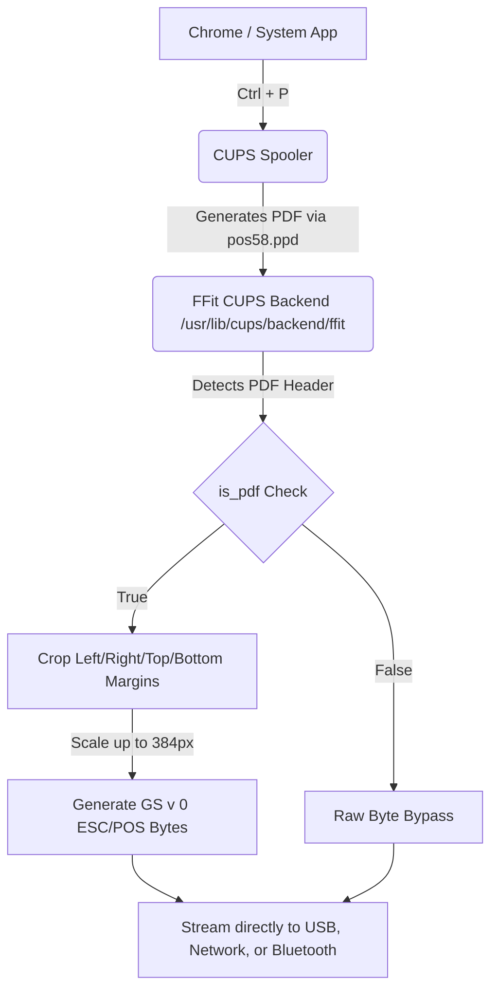

# 🖨️ FFit Thermal Printer Driver — Ubuntu Linux

[](LICENSE)
[]()
[]()
[]()

A premium, high-performance Flutter desktop application combined with a custom CUPS backend. Seamlessly connect, manage, and print to **58mm Thermal Printers** using **USB, Network (WiFi/LAN), or Bluetooth** directly from Ubuntu Linux (including full support for Google Chrome and system print dialogues).

---

## 🌟 Features
* **Exclusive 58mm Thermal Sizing**: Tailored specifically for 58mm roll widths. 80mm and other formats are disabled for absolute sizing consistency.
* **Auto-Scaling Margin Crop**: Automatically crops left, right, top, and bottom page margins added by Chrome or PDF viewers. Scales content up to fill the full printable width (384px) for big, readable fonts.
* **One-Click CUPS Integration**: Registers the printer queue globally as a **Zijiang ZJ-58** thermal receipt printer, enabling immediate detection inside Chrome and other apps.
* **Three Connection Channels**:
  * 🖨️ **USB** (`/dev/usb/lp0` direct kernel stream)
  * 🌐 **Network** (TCP Raw Port 9100)
  * 📶 **Bluetooth** (RFCOMM SPP protocol)
* **Custom PDF-to-Raster Engine**: Converts PDFs into ESC/POS `GS v 0` raster data using high-speed PIL rendering.

---

## 🚀 Quick Installation

### Option 1: One-Command Installation (Pre-built Release)
If you want to install the pre-compiled production release directly on your machine without building from source, copy and paste this one-liner into your terminal:

```bash
wget -qO- https://github.com/i-amraj/FFIT_Printer_with_wifi/raw/main/ffit-printer-linux-x64.tar.gz | tar xvz && cd ffit-printer-linux-x64 && chmod +x install.sh && sudo ./install.sh && cd .. && rm -rf ffit-printer-linux-x64
```

### Option 2: Installation from Source (Development Mode)
If you are developing or want to build from source:
```bash
# Clone the repository
git clone https://github.com/i-amraj/ffit-linux-printer-driver.git
cd ffit-linux-printer-driver

# Build the Flutter GUI
cd ffit_printer_ubuntu
flutter build linux --release
cd ..

# Run the installer script
chmod +x installer/install.sh
sudo ./installer/install.sh
```

---

## 📋 Project Directory Structure

```
ffit-ubuntu/
├── ffit_printer_ubuntu/          ← Flutter Desktop App (GUI)
│   ├── assets/
│   │   └── logo.png              ← App Logo
│   └── lib/
│       ├── main.dart
│       ├── models/
│       │   └── printer_config.dart       ← Config Model (58mm limits)
│       ├── services/
│       │   ├── config_service.dart       ← ~/.config/ffit/printer.json
│       │   ├── printer_service.dart      ← USB/Network/BT I/O Streams
│       │   ├── escpos_service.dart       ← ESC/POS Command Builder
│       │   ├── discovery_service.dart    ← USB/Net/BT scans
│       │   └── printer_provider.dart     ← CUPS Registration & State
│       └── screens/
│           ├── home_screen.dart          ← Connection Dashboard
│           ├── discovery_screen.dart     ← Scan & Connect Bottom Sheet
│           └── settings_screen.dart      ← System Control & CUPS setup
│
├── cups_backend/
│   └── ffit                              ← CUPS backend script (Python)
│
└── installer/
    ├── install.sh                        ← Project Installer Script
    ├── pos58.ppd                         ← ZJ-58 PPD layout (58mm limits)
    └── icon.png                          ← App launcher icon
```

---

## 🛠️ How It Works



1. **CUPS Integration**: When you register the printer via the app, it uses `/usr/share/ppd/custom/pos58.ppd` with the null PDF filter. Chrome layouts pages specifically for 58mm rolls.
2. **Page Cropper & Scaler**: Our python backend (`cups_backend/ffit`) automatically checks the print file header:
   * If it is a PDF, it processes it via `pdftoppm` at 203 DPI, crops all empty side margins, resizes the content to exactly 384 pixels, converts it to `GS v 0` raster commands, and appends a branded footer (`Powered by FFIT.IO`).
   * If it is already raw printer bytes, it bypasses rendering and streams it directly to the device.

---

## 🔧 Developer Guide & Manual Build

If you want to modify the source code or build/deploy manually:

### 1. Build the Flutter GUI
```bash
cd ffit_printer_ubuntu
flutter build linux --release
```

### 2. Manually Setup CUPS Backend & PPD
```bash
# Copy backend
sudo cp cups_backend/ffit /usr/lib/cups/backend/ffit
sudo chmod 755 /usr/lib/cups/backend/ffit
sudo chown root:root /usr/lib/cups/backend/ffit

# Copy PPD
sudo mkdir -p /usr/share/ppd/custom
sudo cp installer/pos58.ppd /usr/share/ppd/custom/pos58.ppd
sudo chmod 644 /usr/share/ppd/custom/pos58.ppd

# Restart CUPS service
sudo systemctl restart cups
```

---

## 🛡️ User Permissions (lp / Bluetooth groups)

If your printer fails to print due to permission errors:
```bash
# Add current user to lp group (for USB printers)
sudo usermod -aG lp $USER

# Add current user to bluetooth group (for Bluetooth printers)
sudo usermod -aG bluetooth $USER
sudo systemctl enable bluetooth
sudo systemctl start bluetooth

# Note: Remember to LOGOUT and LOGIN back in for groups to apply!
```

---

## 🐛 Troubleshooting

| Problem | Root Cause | Solution |
| :--- | :--- | :--- |
| **USB: Permission denied** | User is not in `lp` group. | Run `sudo usermod -aG lp $USER` and **log out + log back in**. |
| **Network: Cannot connect** | Printer is on a different subnet or port 9100 is closed. | Check printer IP, ping it, and ensure it's on the same WiFi/LAN. |
| **Bluetooth: rfcomm binding error** | Bluetooth service is inactive or pairing failed. | Run `sudo systemctl start bluetooth` and pair the device via settings. |
| **No printer in Chrome** | CUPS daemon hasn't reloaded the printer queues. | Restart CUPS: `sudo systemctl restart cups`. |

---

*Developed with ❤️ by Raj — Premium ESC/POS Printing Solutions*
